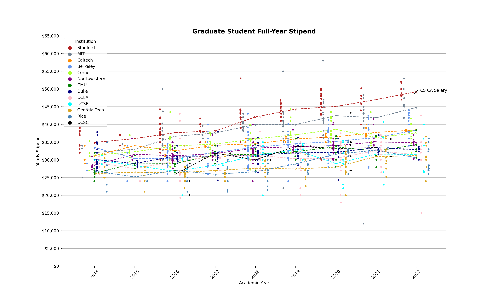

# grad_stipends
ongoing data analysis of graduate student pay, live repository.

### data sources
https://phdstipends.com \
https://academicsalaries.github.io \
https://open.ga.gov/

### examples
For instance, salary trends for a few universities in the past eight years, along with average trendlines\


and a time-evolving salary distribution for Georgia Tech TAs\
<video src="https://user-images.githubusercontent.com/50782222/212172541-4eaf44dd-01e3-4d75-9209-2e5dd88f48d8.mp4" controls="controls"></video>

### requirements
python 3.7 (pandas, numpy, scipy, matplotlib, seaborn, sqlite, pandasql)

### directory structure
```bash
main-stipends/
- plot.py #plotting functions
- data.py #interface with sql queries
gt-stipends/ #salary analysis for Georgia Tech
- inflation/ #mp4 files of inflation-aware salary distributions
- normal/ #mp4 files of salary distributions
- main.py #main driver file
```
